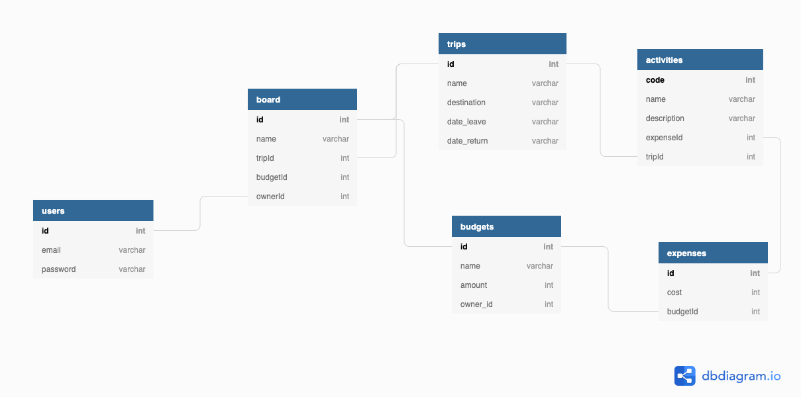

# travel-budget-app
> A way to track travel and budgets on the go

# Dev Steps
* [x] Generate Server
* [x] Generate Client
* [x] Add local auth to server
* [x] Create DB realtionship diagram
* [x] Install postgres and create db
* [x] Add vuetify to client
* [x] Add feathers-vuex to client
* [x] Add login to client
* [x] Test auth from client to server
* [x] Add logout to client
* [x] Handle wrong password auth flow

* [ ] Add trip service to server
* [ ] User can create/list/view trips on client
  * [ ] Create
    * [ ] Add owner_id
  * [ ] List
    * [ ] Restrict to owner
  * [ ] View
    * [ ] Restrict to owner

* [ ] Add budgets service to server
* [ ] User can create/list/view budget for trips on client
  * [ ] Create
    * [ ] Restrict to trip owner
  * [ ] List
    * [ ] Restrict to trip owner
* [ ] Store should update trips/budget when login/logout

* [ ] Finalize thoughts on db design for trips/lists/activities
* [ ] Build component for boards
* [ ] Build component for trips
* [ ] Setup [route guard](https://forum.vuejs.org/t/log-out-programatically-and-navigate-away-from-restricted-route-after-log-out/54259) for boards route
* [ ] Dockerize Client and Server with Dockercompose

## Tech
__Client__:
Vue CLI 4 - Client Framework
Vuetify - Material Design UI
Feathers-rest

__Server__:
Feathers JS - Server Framework
Postgres SQL w/ Sequelize - Database

## Notes
Class based TS - Vue: https://www.sitepoint.com/  class-based-vue-js-typescript/
Handle Auth: https://scotch.io/tutorials/ handling-authentication-in-vue-using-vuex


## Diagram




# Server


## About

This project uses [Feathers](http://feathersjs.com). An open source web framework for building modern real-time applications.

## Getting Started

Getting up and running is as easy as 1, 2, 3.

1. Make sure you have [NodeJS](https://nodejs.org/) and [npm](https://www.npmjs.com/) installed.
2. Install your dependencies

    ```
    cd path/to/travel-budget-app
    npm install
    ```

3. Start your app

    ```
    npm start
    ```

## Testing

Simply run `npm test` and all your tests in the `test/` directory will be run.

## Scaffolding

Feathers has a powerful command line interface. Here are a few things it can do:

```
$ npm install -g @feathersjs/cli          # Install Feathers CLI

$ feathers generate service               # Generate a new Service
$ feathers generate hook                  # Generate a new Hook
$ feathers help                           # Show all commands
```

## Help

For more information on all the things you can do with Feathers visit [docs.feathersjs.com](http://docs.feathersjs.com).


# Client

## Project setup
```
npm install
```

### Compiles and hot-reloads for development
```
npm run serve
```

### Compiles and minifies for production
```
npm run build
```

### Lints and fixes files
```
npm run lint
```

